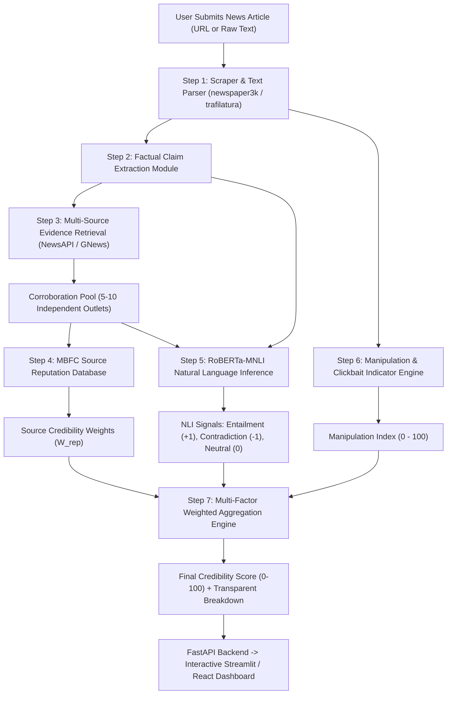

# PSAIAC_61: Real-Time News Misinformation & Credibility Verification System
## 5-Phase Comprehensive Project Blueprint & Engineering Roadmap

---

## 1. Executive Summary & Problem Formulation

### Problem Statement (PSAIAC_61)
> *"Misinformation spreads ~6x faster than real news online. Your system needs to evaluate a news article in real time and score it on: factual accuracy, source credibility, and manipulation indicators."* (Difficulty: Medium-High)

### Core Differentiator: Cross-Source Corroboration vs. Naive Text Classification
Traditional fake news detectors use simple NLP classification on the input text alone (e.g. *"does this sentence look linguisticly suspicious?"*), which fails when misinformation is phrased professionally or when real news contains emotional phrasing. 

**PSAIAC_61 uses Cross-Source Corroboration with Natural Language Inference (NLI)**:
1. It extracts testable factual claims.
2. It fetches independent real-time reporting from diverse news outlets.
3. It cross-checks the claim against retrieved evidence using **RoBERTa-MNLI** (Entailment, Contradiction, Neutral).
4. It weights every corroborating and contradicting outlet using a comprehensive **MBFC Source Reputation Database**.
5. It inspects linguistic and structural **Manipulation Indicators** (clickbait, fear-mongering, conspiracy patterns).

---

## 2. Formal 5-Phase Project Roadmap

| Phase | Timeline | Milestone Title | Primary Deliverables & Objectives | Status |
|:---|:---:|:---|:---|:---:|
| **Phase 1** | Weeks 1–2 | **Problem Definition, Literature Survey & Architecture Blueprint** | • Problem scope definition & state-of-the-art literature review. • Comparison between NLI-based corroboration vs. text classifiers. • Tech stack finalization (RoBERTa-MNLI, MBFC, FastAPI, Streamlit). • End-to-end data pipeline architectural blueprint. | ✅ Completed |
| **Phase 2** | Weeks 3–4 | **Dataset Acquisition, Source Reputation Database & Manipulation Lexicons** | • MBFC dataset acquisition & normalization (4,442 unique domains). • Indexed SQLite source reputation database with sub-ms lookup. • Canonical URL/domain resolution and institutional TLD fallbacks. • Ground-truth benchmark claims dataset (`test_claims_benchmark.json`). • Manipulation and sensationalism lexical dataset and baseline detector. • EDA report and interactive verification CLI demo suite. | 🚀 **Completed (Phase 2 Milestone)** |
| **Phase 3** | Weeks 5–6 | **Claim Extraction Engine & Multi-Source Evidence Retrieval** | • Article ingestion pipeline via `trafilatura` and `newspaper3k`. • Factual claim extractor using POS/NER heuristics + sentence ranking. • Integration with NewsAPI / GNews API to retrieve top 5–10 corroborating articles. • Article cleaning, deduplication, and evidence pool construction. | ⏳ Upcoming |
| **Phase 4** | Weeks 7–8 | **RoBERTa-MNLI Corroboration Engine & Manipulation Analyzer** | • Hugging Face `roberta-large-mnli` model integration & inference pipeline. • Pairwise NLI classification: (Claim, Retrieved Sentence) -> `{Entailment, Contradiction, Neutral}`. • Semantic relevance filtering to discard off-topic evidence. • Full manipulation scoring engine integration. | ⏳ Upcoming |
| **Phase 5** | Weeks 9–10+ | **Score Aggregator, FastAPI Backend & Interactive UI Dashboard** | • Multi-factor weighted credibility scoring formula implementation. • FastAPI REST API (`/analyze/url`, `/analyze/text`, `/lookup/source`). • Interactive Streamlit / React UI with visual evidence breakdown. • End-to-end benchmark testing, error analysis, and final project report. | ⏳ Upcoming |

---

## 3. Mathematical Scoring Formulation

The final credibility score $C \in [0, 100]$ is computed using a multi-factor weighted aggregation model:

### 1. Evidence Corroboration Sub-Score ($S_{\text{evidence}}$)
Given a claim $C$ and a pool of $N$ retrieved evidence articles from domains $\{d_1, d_2, \dots, d_N\}$:

$$S_{\text{evidence}} = \frac{\sum_{i=1}^N \left( W_{\text{rep}}(d_i) \times \Phi(\text{NLI}_i) \right)}{\sum_{i=1}^N W_{\text{rep}}(d_i)}$$

Where:
- $W_{\text{rep}}(d_i) \in [0.0, 1.0]$ is the MBFC reputation weight of domain $d_i$ (e.g., Reuters = 1.0, Daily Mail = 0.45, InfoWars = 0.05, The Onion = 0.0).
- $\Phi(\text{NLI}_i) \in [-1.0, +1.0]$ is the directional agreement signal derived from RoBERTa-MNLI:
  $$\Phi(\text{NLI}_i) = P(\text{Entailment}) - P(\text{Contradiction})$$

### 2. Article Manipulation Penalty ($P_{\text{manip}}$)
$$P_{\text{manip}} = \alpha \cdot \left( \frac{M_{\text{index}}}{100} \right)$$
where $M_{\text{index}} \in [0, 100]$ is the manipulation index and $\alpha = 0.25$ is the penalty weight.

### 3. Origin Source Baseline ($S_{\text{origin}}$)
If the input article's publishing domain $d_{\text{origin}}$ is known:
$$S_{\text{origin}} = W_{\text{rep}}(d_{\text{origin}}) \times 100$$

### 4. Final Aggregated Credibility Score
$$\text{Final Score} = \beta \cdot \left( \frac{S_{\text{evidence}} + 1}{2} \times 100 \right) + (1 - \beta) \cdot S_{\text{origin}} - P_{\text{manip}}$$
(clamped to $[0, 100]$, where $\beta = 0.70$ prioritizes independent external corroboration).

---

## 4. Tech Stack Breakdown

| Layer | Technology | Function |
|:---|:---|:---|
| **Programming Language** | Python 3.11+ | Core runtime and pipeline orchestration |
| **Source Reputation DB** | SQLite 3 + In-Memory Cache | Sub-millisecond lookup across 4,442 news domains |
| **Domain & URL Engine** | `tldextract` + Custom Normalizer | Canonical apex domain resolution & TLD heuristics |
| **Claim Corroboration** | RoBERTa-MNLI (`roberta-large-mnli`) | Deep NLI: Entailment, Contradiction, Neutral |
| **Evidence Retrieval** | News API / GNews API | Live retrieval of multi-outlet reporting pools |
| **Web Ingestion** | `trafilatura` / `newspaper3k` | Robust article body, title, and metadata extraction |
| **Backend API** | FastAPI + Pydantic v2 | High-throughput asynchronous REST API endpoints |
| **Frontend UI** | Streamlit / React | Interactive real-time verification dashboard |
