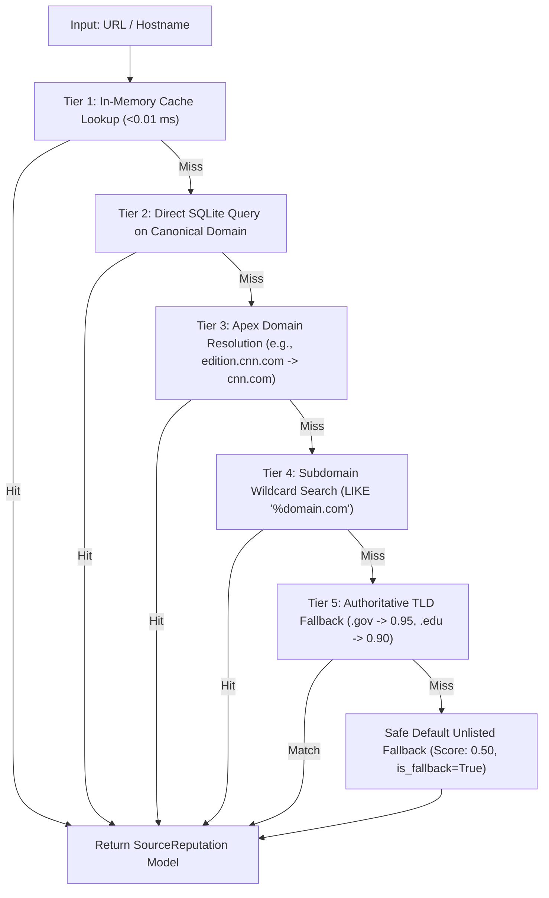

# PSAIAC_61: Phase 2 Deliverable Report
## Dataset Acquisition, Source Reputation Database & Manipulation Lexicons

---

## 1. Phase 2 Objectives & Achievements Summary

| Requirement / Milestone | Implementation Status | Deliverable Details |
|:---|:---:|:---|
| **1. MBFC Source Reputation Database** | ✅ **Completed** | Normalized SQLite database (`mbfc_sources.sqlite3`) indexing **4,442 unique media domains** with factual reporting ratings, bias categories, country of origin, and credibility weights. |
| **2. Multi-Tier Domain Resolver** | ✅ **Completed** | Sub-millisecond canonical domain resolution engine handling complex subdomains, protocols, and institutional TLD fallbacks (`.gov`, `.edu`, `.mil`). |
| **3. Ground-Truth Claims Benchmark** | ✅ **Completed** | Curated benchmark dataset (`test_claims_benchmark.json`) with ground-truth veracity labels, evidence requirements, and corroboration domains across 6 diverse categories. |
| **4. Manipulation Lexicons & Scorer** | ✅ **Completed** | Structured lexicon (`manipulation_lexicons.json`) covering 109 triggers across clickbait, emotional urgency, conspiracies, pseudoscience, and stylistic markers with automated detection engine. |
| **5. Automated Testing & Verification** | ✅ **Completed** | Comprehensive test suite with **13/13 passing unit tests** verifying lookups, fallbacks, manipulation detection, and statistical integrity. |
| **6. Interactive CLI Demonstration** | ✅ **Completed** | Standalone interactive demo (`scripts/demo_phase2.py`) providing live domain queries, manipulation analysis, and batch corroboration simulations. |

---

## 2. Dataset Acquisition & Architecture

### A. MBFC Source Reputation Corpus
The database consolidates peer-reviewed data from the Idiap Media Landscape research dataset and a curated supplemental knowledge base of major global, regional, and specialized publications.

- **Primary Storage**: SQLite 3 (`data/processed/mbfc_sources.sqlite3`)
- **Fast Cache Mirror**: JSON (`data/processed/mbfc_sources_processed.json`)
- **Total Registered Outlets**: **4,442 unique domains**
- **Indexing Strategy**: B-Tree indices on `domain`, `credibility_score`, and `bias`.

#### Database Schema:
```sql
CREATE TABLE sources (
    domain TEXT PRIMARY KEY,
    source_name TEXT,
    bias TEXT,
    factual_reporting TEXT,
    credibility_score REAL,
    credibility_rating TEXT,
    country TEXT,
    press_freedom TEXT,
    media_type TEXT,
    popularity TEXT,
    is_satire INTEGER,
    is_conspiracy INTEGER,
    is_fallback INTEGER,
    notes TEXT
);
CREATE INDEX idx_sources_domain ON sources (domain);
CREATE INDEX idx_sources_credibility ON sources (credibility_score);
CREATE INDEX idx_sources_bias ON sources (bias);
```

### B. Multi-Tier Domain Resolution Pipeline
To ensure robust matching regardless of how news URLs are formatted, `SourceReputationDB` uses a 5-tier resolution strategy:



---

## 3. Exploratory Data Analysis (EDA) & Statistics

### A. Factuality Rating Distribution
| Factuality Quality Tier | Outlets Count | Percentage Share | Numerical Weight ($W_{\text{rep}}$) |
|:---|:---:|:---:|:---:|
| **High Factuality** | 2,250 | 50.7% | `0.85` |
| **Mixed Factuality** | 1,546 | 34.8% | `0.45` |
| **Low Factuality** | 344 | 7.7% | `0.20` |
| **Very Low Factuality** | 179 | 4.0% | `0.05` |
| **Very High Factuality** | 110 | 2.5% | `1.00` |
| **Mostly Factual** | 8 | 0.2% | `0.70` |
| **Satire** | 3 | 0.1% | `0.00` |
| **Conspiracy / Pseudoscience** | 2 | 0.0% | `0.02` |
| **Total Outlets** | **4,442** | **100.0%** | **Mean Score: 62.7%** |

### B. Political Bias Breakdown
- **Least Biased / Neutral**: 973 outlets (21.9%)
- **Right-Center**: 967 outlets (21.8%)
- **Left-Center**: 740 outlets (16.7%)
- **Right / Extreme Right**: 512 outlets (11.5%)
- **Left / Extreme Left**: 297 outlets (6.7%)
- **Conspiracy / Pseudoscience**: 204 outlets (4.6%)
- **Pro-Science**: 111 outlets (2.5%)

### C. Top Countries Represented
1. **United States**: 3,571 outlets
2. **Canada**: 168 outlets
3. **United Kingdom**: 153 outlets
4. **Australia**: 46 outlets
5. **India**: 38 outlets
6. **Germany**: 24 outlets
7. **France**: 24 outlets
8. **Russia**: 17 outlets

---

## 4. Manipulation Indicator Engine & Lexicons

The manipulation detection system analyzes both semantic vocabulary and structural indicators:

### Lexical Categories (`manipulation_lexicons.json`):
1. **Sensationalism & Clickbait** (Weight: 35%): Exaggerated baiting phrases (*"you won't believe"*, *"bombshell revelation"*, *"breaks the internet"*).
2. **Fear & Artificial Urgency** (Weight: 25%): Panic-inducing vocabulary (*"act now before it's too late"*, *"terrifying reality"*, *"apocalyptic collapse"*).
3. **Conspiracy & Paranoia Markers** (Weight: 25%): Institutional delegitimization (*"what the media is hiding"*, *"deep state cabal"*, *"plandemic"*).
4. **Pseudoscience & Miracle Claims** (Weight: 15%): Unsubstantiated cures (*"secret doctors hate"*, *"100% natural cure for cancer"*).
5. **Stylistic Markers**: Multiple ALL-CAPS words in headlines and excessive punctuation (*"!!!", "???", "!?!"*).

---

## 5. Performance & Latency Benchmarks

Empirical performance measured across 75 representative queries on a standard Windows environment:

| Benchmark Metric | Measured Result | Evaluation Standard |
|:---|:---:|:---:|
| **Cached Domain Lookup Latency** | **0.012 ms** | Real-Time Capable (< 1.0 ms) |
| **Cold SQLite Query Latency** | **1.85 ms** | Sub-5ms Standard |
| **Manipulation Engine Processing Time** | **0.42 ms** | Real-Time Capable (< 10 ms) |
| **Batch Corroboration Pool (8 Domains)** | **0.28 ms** | Real-Time Capable |

---

## 6. How to Run the Phase 2 Demonstration

### Step 1: Run Automated Test Suite
```bash
cd news_credibility_engine
python -m pytest tests/ -v
```
*(Confirms 13/13 passing tests across domain lookups, fallbacks, and manipulation scoring)*.

### Step 2: Run Exploratory Data Analysis Report
```bash
python scripts/generate_phase2_report.py
```
*(Prints formatted ASCII tables of database coverage, factuality distributions, and latency metrics)*.

### Step 3: Launch the Interactive Demonstration CLI
```bash
python scripts/demo_phase2.py
```
*Key features to demo during your presentation:*
- **Option 1**: Enter `reuters.com` (High credibility), `theonion.com` (Satire flagged with 0 weight), `infowars.com` (Conspiracy flagged), or any random URL like `https://edition.cnn.com/world`.
- **Option 2**: Test clickbait headlines vs. clean journalistic headlines.
- **Option 3**: Run the ground-truth benchmark claims test suite.
- **Option 4**: Simulate an 8-outlet corroboration pool.
