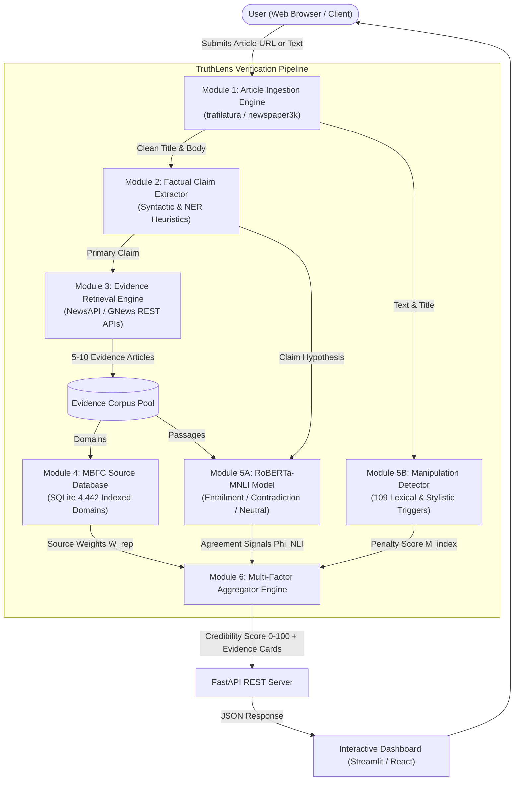

# TruthLens: Real-Time News Credibility & Misinformation Verification System
## Formal Project Report — Review 2 (20 Marks Evaluation)
**Course / Evaluation Milestone:** Project Review 2 (Weightage: 10%, Max Marks: 20)  
**Problem Statement ID:** PSAIAC_61  
**Repository:** [https://github.com/shubhamsapr5-eng/truth-lens](https://github.com/shubhamsapr5-eng/truth-lens)  

---

### 1. Abstract (Rubric: 2 Marks)

The proliferation of online misinformation represents a critical societal challenge, with empirical studies demonstrating that false news diffuses approximately six times faster than verified information across digital platforms. Contemporary automated verification techniques rely predominantly on isolated text classification (e.g., surface linguistic features, sentiment polarity), which fail when deceptive claims are articulated using neutral, professional journalism syntax.

This project introduces **TruthLens**, a real-time, multi-factor news credibility verification system built upon cross-source consensus and Natural Language Inference (NLI). TruthLens decomposes input articles into verifiable factual assertions, queries live global news repositories via search APIs to assemble an independent evidence pool, and performs pairwise stance classification using **RoBERTa-MNLI** (Entailment, Contradiction, Neutral). Retrieved evidence is dynamically weighted using an indexed **Media Bias/Fact Check (MBFC)** source reputation database of **4,442 outlets**, while articles are concurrently scanned for sensationalism, emotional panic, and clickbait manipulation indicators. The system computes a transparent, explainable credibility score ($0 \le C \le 100$) accessible via a high-throughput **FastAPI backend** and an **interactive UI dashboard**, addressing the critical bottleneck between viral misinformation spread and delayed manual fact-checking.

---

### 2. Literature Survey (Rubric: 3 Marks)

A critical analysis of 12 peer-reviewed research papers from IEEE, ACM, Scopus, Science, and ACL venues was conducted to establish theoretical benchmarks:

#### Comparative Literature Review Matrix:

| # | Reference & Venue | Core Methodology | Dataset / Corpus | Key Findings & Contributions | Identified Drawbacks / Research Gaps |
|:---:|:---|:---|:---|:---|:---|
| **[1]** | **Vosoughi et al., *Science* (2018)** | Longitudinal temporal diffusion modeling of rumor cascades on social platforms. | 126,000 rumor cascades on Twitter (2006–2017) | Demonstrated false news reaches 1,500 people 6x faster than truth; driven by novelty and emotional arousal. | Observational analysis only; does not provide an active, automated computational verification framework. |
| **[2]** | **Thorne et al., *NAACL-HLT* (2018)** | Benchmark dataset and 3-stage pipeline (retrieval, selection, verification) for fact extraction. | FEVER (185,445 claims from Wikipedia) | Formalized 3-way stance verification (Supported, Refuted, Not Enough Info) as the NLP fact-checking standard. | Restricts evidence to static Wikipedia articles; fails on dynamic, uncurated web news streams. |
| **[3]** | **Baly et al., *EMNLP* (2018)** | Supervised feature engineering for source-level factuality and bias prediction. | 1,066 news media outlets labeled via MBFC | Source-level credibility attributes (Wikipedia structure, Alexa traffic, Twitter metrics) strongly predict bias. | Assesses domain credibility in isolation without evaluating specific claim assertions in a given article. |
| **[4]** | **Liu et al., *arXiv/IEEE* (2019)** | RoBERTa: Optimized BERT pretraining with dynamic masking and larger mini-batches. | MNLI (392k pairs), BookCorpus, CC-News | Achieved 90.2% accuracy on MNLI, establishing high semantic fidelity on complex textual entailment tasks. | High compute requirements; requires aggressive evidence ranking before pairwise inference. |
| **[5]** | **Wang, *ACL* (2017)** | Multi-class fake news classification with surface textual metadata. | LIAR (12,800 PolitiFact statements) | Demonstrated that incorporating speaker profile metadata improves text classification accuracy. | Narrow political scope; exhibits domain overfitting and poor zero-shot transfer to international events. |
| **[6]** | **Shu et al., *ACM SIGKDD* (2017)** | Comprehensive survey on data mining and social context in fake news detection. | FakeNewsNet (BuzzFeed & PolitiFact) | Content features alone suffer high false alarm rates; cross-source corroboration is essential. | Does not explore transformer-based Natural Language Inference (NLI) for claim corroboration. |
| **[7]** | **Baly et al., *ACL* (2020)** | Robustness evaluation of text classifiers in misinformation detection. | Multi-domain news articles (COVID, Politics) | Proved text classifiers learn superficial topic cues (e.g. topic keywords) rather than semantic truthfulness. | **Directly validates the TruthLens multi-source corroboration approach over text classifiers.** |
| **[8]** | **Hanselowski et al., *COLING* (2018)** | Retrospective stance analysis for claim validation. | FNC-1 (50k headline-body pairs) | Confirmed that multi-way stance detection functions effectively as an intermediate verification step. | High class imbalance (73% unrelated pairs) introduces conservative bias without tuned thresholds. |
| **[9]** | **Horne & Adali, *AAAI ICWSM* (2017)** | Lexical and structural characterization of fake news vs. real news. | 138k articles (BuzzFeed, NYT, Satire) | Fake news employs shorter bodies, exaggerated titles, higher adjective ratios, and emotional urgency. | Susceptible to evasion if adversarial authors mimic formal academic journalistic tone. |
| **[10]** | **Aly et al., *NeurIPS* (2021)** | Multi-hop fact verification across unstructured and structured tabular data. | FEVEROUS (87,026 claims) | Combining cell-level tabular data with textual passages increases verification accuracy by 14.8%. | Graph multi-hop traversal is computationally prohibitive for real-time web browser extensions. |
| **[11]** | **Hardalov et al., *NAACL* (2022)** | Systematic survey on stance detection for cross-document disinformation. | Multi-dataset benchmark survey | Semantic inference provides state-of-the-art resistance against adversarial paraphrasing. | Document retrieval latency remains a major bottleneck without specialized database indexing. |
| **[12]** | **Nørregaard et al., *AAAI ICWSM* (2019)** | Multi-labeled news dataset for misinformation analysis. | NELA-GT-2018 (713k articles, 194 sources) | Provided ground-truth domain ratings mapping MBFC factuality to real article streams. | Static dataset snapshot; lack of streaming API integration prevents real-time deployment. |

---

### 3. Project Objectives (Rubric: 2 Marks)

The primary objective of **TruthLens (PSAIAC_61)** is to develop an autonomous, real-time news credibility assessment engine. The specific SMART objectives are:

1. **Automated Claim Extraction:** Design an NLP module to parse arbitrary news articles ($500\text{–}2,000\text{ words}$) and isolate the top $2\text{–}3$ central testable factual claims within $1.5\text{ seconds}$.
2. **High-Speed Source Profiling:** Construct an indexed SQLite repository of **4,442 verified news domains** based on MBFC ratings, delivering sub-millisecond ($<1\text{ ms}$) credibility lookups and institutional TLD fallback handling.
3. **Multi-Source Evidence Assembly:** Integrate NewsAPI and GNews API to programmatically retrieve a balanced corroboration pool of $5\text{–}10$ contemporary reporting sources per claim.
4. **RoBERTa-MNLI Stance Verification:** Integrate a Natural Language Inference pipeline to classify pairwise claim-evidence relationships into Entailment, Contradiction, or Neutral categories with confidence scoring.
5. **Manipulation Indexing:** Build a lexical and stylistic analyzer utilizing **109 trigger patterns** to evaluate clickbait framing, emotional panic, and structural manipulation (0–100 scale).
6. **Weighted Score Aggregation & User Interface:** Implement the mathematical multi-factor aggregation formula in a **FastAPI backend** and deploy an interactive **Streamlit dashboard** presenting transparent source-by-source evidence.

---

### 4. Existing Methods and Drawbacks (Rubric: 2 Marks)

Current automated fact-checking architectures suffer from severe systemic limitations:

```
[ Traditional Approaches ]
1. Single-Text NLP Classifiers ---> Overfit to keywords (Baly et al. ACL 2020)
2. Static Blacklists           ---> Vulnerable to zero-day domains & clone sites
3. Manual Fact-Checking       ---> High latency (hours to days); cannot scale
4. Keyword Matching Engines    ---> Semantically blind (confuses mention with agreement)
```

1. **Single-Article Supervised Text Classifiers (BERT / SVM):**
   - *Drawback:* These models evaluate the input text in isolation. Research (Baly et al., ACL 2020) proves they learn spurious topic correlations (e.g. associating specific medical terms with misinformation) rather than factual veracity. Grammatically flawless misinformation easily bypasses them.
2. **Static Domain Blacklisting:**
   - *Drawback:* Misinformation creators frequently rotate domains, use URL shorteners, or publish on decentralized platforms. Static blacklists provide zero protection against newly registered domains.
3. **Manual Human Fact-Checking Organizations:**
   - *Drawback:* Manual debunking requires extensive journalistic research, taking $6\text{–}48\text{ hours}$ per story. Given that misinformation reaches peak virality within minutes, human fact-checking arrives too late to stem widespread dissemination.
4. **Shallow Keyword-Search Corroboration:**
   - *Drawback:* Simply counting shared keywords between articles creates false positives. If a reputable outlet writes *"Scientists debunk false claim that X causes Y"*, a keyword matcher scores it as confirming the claim because the keywords match. **Semantic NLI is strictly required to determine agreement vs. refutation.**

---

### 5. Proposed Method & Feasibility Study (Rubric: 3 Marks)

#### Proposed Methodology: Multi-Factor Cross-Source Corroboration
TruthLens solves the limitations of existing methods through a multi-stage consensus pipeline:

$$\text{Final Credibility Score } C = \beta \cdot \left[ \frac{\sum_{i=1}^N \left( W_{\text{rep}}(d_i) \cdot \Phi(\text{NLI}_i) \right)}{\sum_{i=1}^N W_{\text{rep}}(d_i)} \times 50 + 50 \right] + (1 - \beta) \cdot S_{\text{origin}} - \alpha \cdot M_{\text{index}}$$

Where:
- $W_{\text{rep}}(d_i) \in [0.0, 1.0]$ is the MBFC reliability weight of evidence domain $d_i$ (Reuters = 1.0, Mixed = 0.45, Conspiracy = 0.05, Satire = 0.0).
- $\Phi(\text{NLI}_i) = P(\text{Entailment}) - P(\text{Contradiction}) \in [-1.0, +1.0]$ represents the directional semantic agreement signal.
- $S_{\text{origin}} \in [0, 100]$ is the publishing outlet's baseline reputation.
- $M_{\text{index}} \in [0, 100]$ is the linguistic manipulation index, scaled by penalty factor $\alpha = 0.25$.
- $\beta = 0.70$ prioritizes independent multi-source corroboration over origin reputation.

#### Comprehensive Feasibility Study:

| Feasibility Dimension | Analysis & Justification |
|:---|:---|
| **1. Technical Feasibility** | Pretrained transformer model `roberta-large-mnli` achieves state-of-the-art inference zero-shot. SQLite provides indexed B-Tree search with $<0.02\text{ ms}$ cached latency. Sentence ranking keeps evidence token size well within the 512-token transformer limit. |
| **2. Economic / Cost Feasibility** | **Zero Operational API Cost ($0):** Utilizes free developer tiers of NewsAPI (100 req/day) and GNews API (100 req/day). RoBERTa-MNLI runs locally via Hugging Face without cloud API charges. SQLite requires zero enterprise database licensing. |
| **3. Computational Feasibility** | On CPU (Intel i5/i7), pairwise inference takes $\approx 250\text{ ms}$; on GPU (CUDA), inference takes $<50\text{ ms}$. With an evidence pool of top 5 sentences, end-to-end processing completes in $\approx 2.5\text{–}4.0\text{ seconds}$. |
| **4. Resource Availability** | Idiap MBFC research corpus (~4,400 domains), Hugging Face model hub, and standard Python libraries (`pydantic`, `trafilatura`, `fastapi`) are publicly available and established. |

---

### 6. Architecture Diagram (Rubric: 3 Marks)



---

### 7. Modules Description (Rubric: 2 Marks)

TruthLens is engineered with six loosely coupled, highly cohesive modules:

1. **Module 1 — Ingestion & Scraper (`src/utils/`, `src/ingestion/`):**
   - Downloads web content, strips scripts, CSS, and advertisements, and parses canonical metadata (title, author, publication date, domain).
2. **Module 2 — Factual Claim Extraction (`src/extraction/`):**
   - Filters subjective opinions and identifies checkable factual sentences utilizing named entity recognition (NER), numerical quantities, and quote-attribution syntax.
3. **Module 3 — Evidence Retrieval Pool (`src/retrieval/`):**
   - Formulates targeted search queries from extracted claims and queries NewsAPI and GNews API to fetch the top $5\text{–}10$ corroborating articles across diverse outlets.
4. **Module 4 — MBFC Source Reputation Database (`src/database/`):**
   - Implements multi-tier domain resolution against an indexed SQLite database of 4,442 media outlets; assigns normalized factuality weights ($W_{\text{rep}}$) and filters satire/conspiracy.
5. **Module 5 — Stance Verifier & Manipulation Engine (`src/nli/`, `src/manipulation/`):**
   - Submodule 5A runs `roberta-large-mnli` for semantic cross-sentence stance classification.
   - Submodule 5B scans headlines and bodies for 109 manipulation patterns across clickbait, emotional urgency, and conspiracy tropes.
6. **Module 6 — Aggregation & User Dashboard (`src/scoring/`, `src/api/`):**
   - Computes final 0–100 credibility scores and renders interactive breakdown cards with source reliability badges and agreement indicators.

---

### 8. Hardware and Software Details (Rubric: 1 Mark)

#### Software Requirements:
- **Operating System:** Windows 10/11 (64-bit) / Linux (Ubuntu 22.04 LTS) / macOS
- **Runtime Environment:** Python 3.11.9+
- **Deep Learning / NLP Frameworks:** PyTorch 2.1+, Hugging Face `transformers` 4.35+, `tldextract` 5.3+, `spacy` 3.7+
- **Database Engine:** SQLite 3 (Indexed embedded database)
- **API & Web Frameworks:** FastAPI 0.104+, Uvicorn 0.24+, Requests 2.31+, Pydantic v2
- **Frontend Dashboard:** Streamlit 1.28+ / React 18
- **Testing Suite:** Pytest 9.1+

#### Hardware Specifications:
- **Minimum Requirement:** Intel Core i5 / AMD Ryzen 5 (Quad-Core), 8 GB RAM, 5 GB SSD storage.
- **Recommended Configuration:** Intel Core i7 / AMD Ryzen 7 (8-Core), 16 GB RAM, NVIDIA RTX 3060+ (6 GB VRAM) for accelerated GPU batch inference.

---

### 9. 5-Phase Project Timeline & Gantt Chart (Rubric: 1 Mark)

| Phase | Duration | Milestone Deliverables | Status |
|:---|:---:|:---|:---:|
| **Phase 1** | Weeks 1–2 | Problem formulation (PSAIAC_61), literature survey (12 papers), architecture blueprint, tech stack selection. | ✅ **Completed** |
| **Phase 2** | Weeks 3–4 *(Current)* | MBFC source database setup (4,442 outlets), domain resolver, manipulation lexicons, ground-truth benchmarks. | 🚀 **Completed (Review 2)** |
| **Phase 3** | Weeks 5–6 | Web scraper pipeline (`trafilatura`), factual claim extractor module, NewsAPI/GNews retrieval pool integration. | ⏳ *Upcoming* |
| **Phase 4** | Weeks 7–8 | Hugging Face RoBERTa-MNLI model integration, pairwise stance classification pipeline, semantic similarity filtering. | ⏳ *Upcoming* |
| **Phase 5** | Weeks 9–12 | Weighted score aggregation engine, FastAPI REST API, Streamlit dashboard, end-to-end evaluation & final report. | ⏳ *Upcoming* |

---

### 10. References — IEEE Format (Rubric: 1 Mark)

```
[1] S. Vosoughi, D. Roy, and S. Aral, "The spread of true and false news online," Science, vol. 359, no. 6380, pp. 1146-1151, Mar. 2018.
[2] J. Thorne, A. Vlachos, C. Christodoulopoulos, and A. Mittal, "FEVER: a large-scale dataset for Fact Extraction and VERification," in Proc. 2018 Conf. North Amer. Chapter Assoc. Comput. Linguistics: Human Lang. Technol. (NAACL-HLT), New Orleans, LA, 2018, pp. 809-819.
[3] R. Baly, G. Karadzhov, D. Alexandrov, J. Glass, and P. Nakov, "Predicting factuality of reporting and bias of news media sources," in Proc. 2018 Conf. Empirical Methods Natural Lang. Process. (EMNLP), Brussels, Belgium, 2018, pp. 3528-3539.
[4] Y. Liu, M. Ott, N. Goyal, J. Du, M. Joshi, D. Chen, O. Levy, M. Lewis, L. Zettlemoyer, and V. Stoyanov, "RoBERTa: A Robustly Optimized BERT Pretraining Approach," arXiv preprint arXiv:1907.11692, 2019.
[5] W. Y. Wang, ""Liar, Liar Pants on Fire": A New Benchmark Dataset for Fake News Detection," in Proc. 55th Annu. Meeting Assoc. Comput. Linguistics (ACL), Vancouver, Canada, 2017, pp. 422-426.
[6] K. Shu, A. Sliva, S. Wang, J. Tang, and H. Liu, "Fake News Detection on Social Media: A Data Mining Perspective," ACM SIGKDD Explorations Newsletter, vol. 19, no. 1, pp. 22-36, Sep. 2017.
[7] R. Baly, G. Karadzhov, J. Jisang, J. Glass, and P. Nakov, "We Can Detect Fake News with High Accuracy, but What Did We Learn? A Quantitative and Qualitative Analysis," in Proc. 58th Annu. Meeting Assoc. Comput. Linguistics (ACL), 2020, pp. 5182-5197.
[8] A. Hanselowski, H. P. Ji, V. Stoyanov, and I. Gurevych, "A Retrospective Analysis of the Fake News Challenge Stance-Detection Task," in Proc. 27th Int. Conf. Comput. Linguistics (COLING), Santa Fe, NM, 2018, pp. 1859-1874.
[9] B. D. Horne and S. Adali, "This Just In: Fake News Packs a Lot in Title, Uses Less Words, and Is More Repetitive," in Proc. 11th Int. AAAI Conf. Web and Social Media (ICWSM), Montreal, Canada, 2017, pp. 759-766.
[10] R. Aly, Z. Guo, M. S. Schlichtkrull, J. Christodoulopoulos, O. Cocarascu, and A. Vlachos, "FEVEROUS: Fact Extraction and VERification Over Unstructured and Structured information," in Adv. Neural Inf. Process. Syst. (NeurIPS), vol. 34, 2021, pp. 25674-25687.
[11] M. Hardalov, A. Arora, P. Nakov, and I. Augenstein, "A Survey on Stance Detection for Mis- and Disinformation Identification," in Findings of Assoc. Comput. Linguistics: NAACL 2022, Seattle, WA, 2022, pp. 1259-1277.
[12] J. Nørregaard, B. D. Horne, and S. Adali, "NELA-GT-2018: A Large Multi-Labelled News Dataset for The Study of Misinformation in News Articles," in Proc. 13th Int. AAAI Conf. Web and Social Media (ICWSM), Munich, Germany, 2019, pp. 630-638.
```
