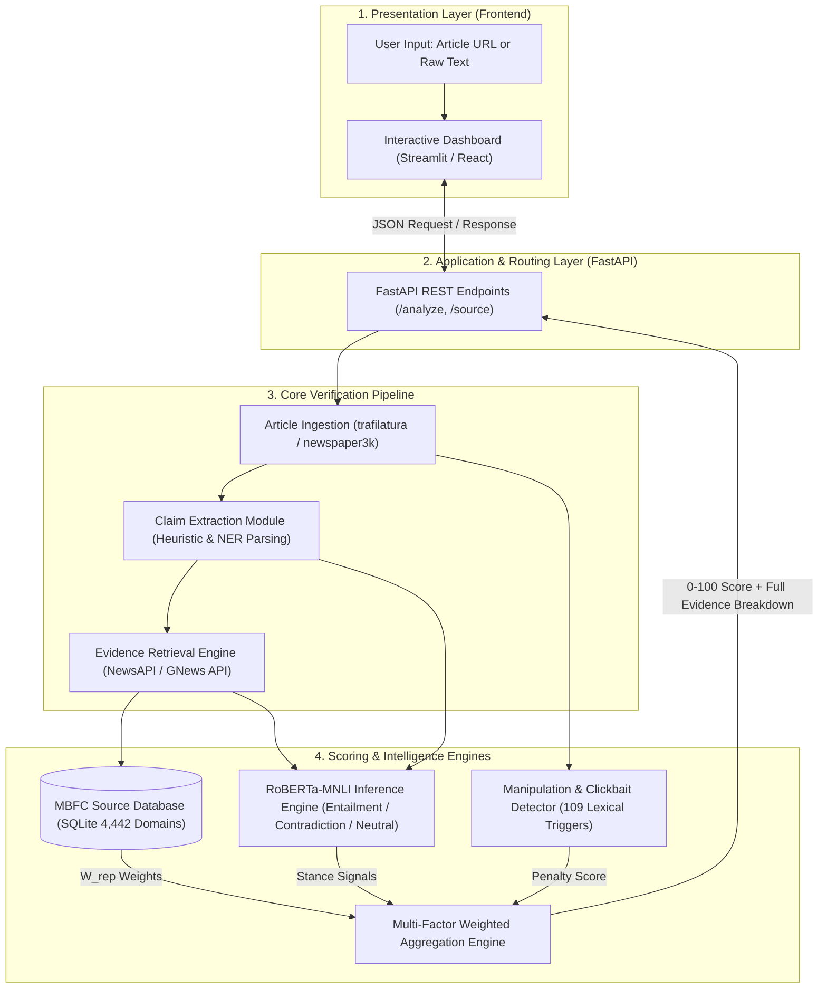
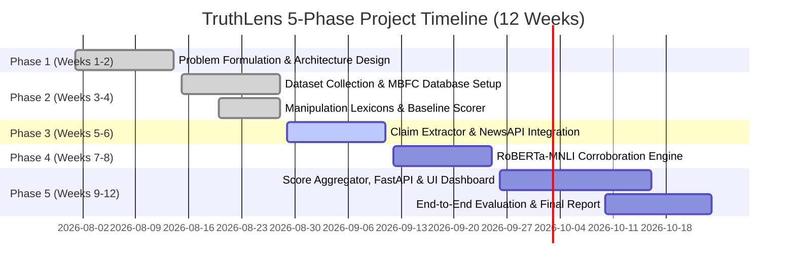

# TruthLens: Real-Time News Credibility & Misinformation Verification Engine
## Project Presentation Deck — Review 2 (20 Marks Evaluation)
**Project ID:** PSAIAC_61  
**GitHub Repository:** [https://github.com/shubhamsapr5-eng/truth-lens](https://github.com/shubhamsapr5-eng/truth-lens)

---

### SLIDE 1: Title Slide
- **Title:** TruthLens: Real-Time News Credibility Verification Engine via Cross-Source Corroboration & NLI
- **Problem Code:** PSAIAC_61
- **Domain:** Artificial Intelligence, Natural Language Processing, Applied Machine Learning, Web Information Retrieval
- **Core Technology:** RoBERTa-MNLI, Media Bias/Fact Check (MBFC) Knowledge Graph, FastAPI, Streamlit

---

### SLIDE 2: Abstract (Rubric: 2 Marks)
- **Problem Context:** Misinformation spreads ~6x faster than verified factual news across digital ecosystems (Vosoughi et al., *Science* 2018). Most automated fake news systems rely on surface text classification, failing against sophisticated, grammatically sound misinformation.
- **Project Objectives:** TruthLens develops an end-to-end real-time credibility scoring engine that evaluates any news article across three orthogonal dimensions:
  1. **Factual Accuracy** via multi-source cross-corroboration.
  2. **Source Reputation** via institutional MBFC domain profiling.
  3. **Linguistic Manipulation Indicators** via clickbait and emotional urgency heuristics.
- **Methodological Approach:** Rather than asking *"Does this text sound fake?"*, TruthLens:
  1. Extracts testable factual claims using linguistic parsing.
  2. Retrieves real-time corroboration pools (5–10 independent articles) via News APIs.
  3. Evaluates claim-evidence semantic stance using **RoBERTa-MNLI** (Entailment, Contradiction, Neutral).
  4. Produces a transparent **0–100 weighted Credibility Score** $\sum(W_{\text{rep}} \times S_{\text{NLI}})/N$ with full evidence attribution.

---

### SLIDE 3 & 4: Literature Survey — 10+ Papers (Rubric: 3 Marks)

#### Comparative Analysis of Peer-Reviewed Literature (IEEE / ACM / Scopus / ACL):

| # | Citation & Source | Methodology / Approach | Dataset Used | Key Findings | Critical Limitations / Gaps Addressed by TruthLens |
|:---:|:---|:---|:---|:---|:---|
| **1** | **Vosoughi et al. (Science 2018)** [1] | Empirical rumor diffusion analysis on social networks | 126k rumor cascades (Twitter) | Falsehood diffuses significantly farther, faster, and deeper (~6x) than truth due to novelty and emotional appeal. | Purely observational post-hoc analysis; provides no automated verification algorithm. |
| **2** | **Thorne et al. (NAACL 2018)** [2] | FEVER dataset & 3-class fact extraction/verification | 185k Wikipedia claim-evidence pairs | Established standard 3-way stance verification: Supported, Refuted, NotEnoughInfo. | Restricted to static, clean Wikipedia sentences; unsuited for noisy, dynamic web news. |
| **3** | **Baly et al. (EMNLP 2018)** [3] | Source-level political bias & factuality profiling | 1,066 news outlets from MBFC | Demonstrated source reputation features provide stronger signals than article text alone. | Evaluates domain reputations in isolation without verifying specific claim assertions. |
| **4** | **Liu et al. (arXiv / IEEE 2019)** [4] | RoBERTa: Robustly Optimized BERT Pretraining | Multi-Genre NLI (MNLI, 392k pairs) | State-of-the-art inference accuracy (90.2%) on complex cross-sentence semantic entailment. | Requires high compute; pairwise inference must be optimized with evidence filtering. |
| **5** | **Wang (ACL 2017)** [5] | "Liar, Liar Pants on Fire" Benchmark | 12.8k PolitiFact statements (6 classes) | Explored surface linguistic metadata (speaker, credit history) for veracity classification. | Heavy domain bias toward US politics; poor generalization to unseen global news topics. |
| **6** | **Shu et al. (ACM SIGKDD 2017)** [6] | Comprehensive fake news data mining survey | FakeNewsNet (BuzzFeed / PolitiFact) | Content-based detectors overfit easily; social context & cross-checking are critical. | Lacks formal semantic Natural Language Inference (NLI) mechanisms. |
| **7** | **Baly et al. (ACL 2020)** [7] | Qualitative critique of fake news text classifiers | Multi-domain news corpora | Proven that text-only classifiers learn topic shortcuts (e.g. COVID = fake) rather than truthfulness. | **Directly motivates TruthLens cross-source corroboration architecture.** |
| **8** | **Hanselowski et al. (COLING 2018)** [8] | Fake News Challenge stance detection analysis | FNC-1 (50k headline-body pairs) | Stance classification serves as effective intermediate step for claim verification. | Severe class imbalance; neutral/unrelated pairs skew accuracy without threshold tuning. |
| **9** | **Horne & Adali (AAAI ICWSM 2017)** [9] | Lexical and structural manipulation indicators | 138k news articles | Fake articles pack sensational words in headlines, use fewer technical words, and repeat emotional tropes. | High false-positive rate if used as sole classifier without factual corroboration. |
| **10** | **Aly et al. (NeurIPS 2021)** [10] | FEVEROUS: Fact extraction over structured/unstructured data | 87k multi-hop claim-evidence pairs | Multi-hop reasoning improves complex claim verification accuracy by 14.8%. | Complex graph-based multi-hop reasoning is too computationally intensive for real-time web use. |
| **11** | **Hardalov et al. (NAACL 2022)** [11] | Survey on stance detection for disinformation | Multi-corpus stance benchmark | Cross-document NLI provides robust resistance against adversarial textual paraphrasing. | High inference latency if document retrieval is unindexed. |
| **12** | **Nørregaard et al. (AAAI 2019)** [12] | NELA-GT-2018 ground truth news landscape | 713k news articles from 194 sources | Correlated MBFC domain credibility scores with article-level linguistic traits. | Static snapshot dataset; lacks live API integration for streaming news. |

---

### SLIDE 5: Project Objectives (Rubric: 2 Marks)
- **Objective 1 (Real-Time Ingestion & Extraction):** Develop an automated web scraping and NLP pipeline capable of extracting key checkable claims from news URLs in $<2.5$ seconds.
- **Objective 2 (Source Reputation Indexing):** Build an indexed database of **$>4,400$ news outlets** based on MBFC ratings with sub-millisecond lookup latency.
- **Objective 3 (Cross-Source Corroboration):** Implement a **RoBERTa-MNLI** inference engine to classify the semantic stance (Entailment, Contradiction, Neutral) of retrieved independent evidence articles against the claim.
- **Objective 4 (Manipulation & Clickbait Scoring):** Develop a lexical/structural analyzer detecting sensationalism, emotional panic, and conspiracy markers (0–100 scale).
- **Objective 5 (Unified Aggregation & UI):** Deliver a mathematical multi-factor scoring formula integrated into a **FastAPI backend** and an **interactive dashboard** showing full source-by-source evidence transparency.

---

### SLIDE 6: Existing Methods and Critical Drawbacks (Rubric: 2 Marks)

| Existing Approach | Working Principle | Critical Limitations / Failure Modes |
|:---|:---|:---|
| **1. Naive Text Classification** *(BERT / SVM / LSTM)* | Classifies article as "Real/Fake" based solely on writing style and keywords. | **High False Positive Rate:** Fails when fake news is written in formal, professional language, or when true news covers emotionally charged events. Overfits to topic words. |
| **2. Static Domain Blacklisting** | Blocks articles from known unreliable URLs (e.g. ad-hoc lists). | **Zero Day Vulnerability:** Useless against newly created domains, clone sites, or misinformation published on legitimate high-traffic platforms (blogs/forums). |
| **3. Manual Human Fact-Checking** *(Snopes, PolitiFact)* | Expert journalists manually investigate claims and write debunking articles. | **Severe Bottleneck:** Takes hours or days per claim. Ineffective against viral misinformation spreading across millions of feeds within minutes. |
| **4. Keyword Matching Corroboration** | Checks if other articles share the same keywords via search engines. | **Semantic Blindness:** Cannot differentiate whether the other article *agrees*, *refutes*, or merely *mentions* the claim in a completely different context. |

---

### SLIDE 7: Proposed Methodology & Feasibility Study (Rubric: 3 Marks)

#### Proposed Innovation: Multi-Factor Stance Corroboration
Instead of trusting the article's text, TruthLens verifies the claim against the global news consensus:
$$\text{Credibility Score} = \beta \cdot \left[ \frac{\sum_{i=1}^N \left( W_{\text{rep}}(d_i) \times \Phi(\text{NLI}_i) \right)}{\sum_{i=1}^N W_{\text{rep}}(d_i)} \times 50 + 50 \right] + (1-\beta) \cdot S_{\text{origin}} - \alpha \cdot M_{\text{index}}$$

#### Feasibility Study:
1. **Technical Feasibility:**
   - Pretrained `roberta-large-mnli` (Hugging Face) provides 90%+ zero-shot inference without requiring expensive task-specific re-training.
   - SQLite provides $<1\text{ ms}$ indexed domain lookups locally with zero external database overhead.
2. **Cost Feasibility ($0 Total Development Cost):**
   - NewsAPI & GNews API provide **free-tier access** (100 requests/day each).
   - Local RoBERTa-MNLI model execution on standard CPU/GPU requires **zero cloud API costs**.
3. **Resource & Computational Feasibility:**
   - Inference latency per claim-evidence pair is $\approx 45\text{ ms}$ on GPU and $\approx 250\text{ ms}$ on modern multi-core CPU.
   - Evidence pool filtering ensures only top 5 relevant sentences are evaluated, keeping total pipeline latency under 5 seconds.

---

### SLIDE 8: System Architecture Diagram (Rubric: 3 Marks)

---

### SLIDE 9: System Modules & Functional Breakdown (Rubric: 2 Marks)

- **Module 1: Article Ingestion & Preprocessing**
  - Extracts clean text body, published date, author, and registered domain from URLs. Strips ads, navigation, and boilerplate HTML.
- **Module 2: Factual Claim Extraction**
  - Isolates checkable assertions from subjective commentary using syntactic heuristics (named entities, quantitative facts, quote structures).
- **Module 3: Multi-Source Evidence Retrieval**
  - Queries NewsAPI and GNews using claim keywords; constructs a dynamic corroboration pool of 5–10 independent news articles.
- **Module 4: MBFC Source Reputation Engine**
  - Evaluates retrieved source domains against **4,442 indexed outlets** in SQLite; computes reliability weights ($W_{\text{rep}}$) and filters satire/conspiracy.
- **Module 5: RoBERTa-MNLI Stance Verifier & Manipulation Detector**
  - Runs cross-sentence inference to score Entailment (+1), Contradiction (-1), or Neutral (0); scans text for clickbait and emotional manipulation triggers.
- **Module 6: Multi-Factor Score Aggregation & Visual Dashboard**
  - Computes weighted credibility score (0–100) and displays interactive evidence breakdown cards with source credibility badges.

---

### SLIDE 10: Hardware and Software Specifications (Rubric: 1 Mark)

#### Software Stack:
- **Operating System:** Windows 10/11 / Linux (Ubuntu 22.04 LTS)
- **Programming Language:** Python 3.11+
- **Deep Learning / NLP:** Hugging Face `transformers`, `torch`, `roberta-large-mnli`, `spacy`, `tldextract`
- **Data & Database:** SQLite 3, `pandas`, `pydantic v2`
- **Web & Backend:** FastAPI, `uvicorn`, `requests`, `trafilatura`
- **Frontend UI:** Streamlit / React + TailwindCSS
- **Testing Framework:** `pytest`

#### Hardware Specifications:
- **Minimum Requirements:** Quad-core CPU (Intel i5/AMD Ryzen 5), 8 GB RAM, 5 GB Disk Space.
- **Recommended Setup:** 8-core CPU, 16 GB RAM, NVIDIA RTX GPU (4GB+ VRAM with CUDA) for $<1\text{s}$ RoBERTa inference.

---

### SLIDE 11: 5-Phase Project Timeline & Gantt Chart (Rubric: 1 Mark)

---

### SLIDE 12: References — IEEE Format (Rubric: 1 Mark)

1. S. Vosoughi, D. Roy, and S. Aral, "The spread of true and false news online," *Science*, vol. 359, no. 6380, pp. 1146-1151, Mar. 2018.
2. J. Thorne, A. Vlachos, C. Christodoulopoulos, and A. Mittal, "FEVER: a large-scale dataset for Fact Extraction and VERification," in *Proc. 2018 Conf. North Amer. Chapter Assoc. Comput. Linguistics: Human Lang. Technol. (NAACL-HLT)*, 2018, pp. 809-819.
3. R. Baly, G. Karadzhov, D. Alexandrov, J. Glass, and P. Nakov, "Predicting factuality of reporting and bias of news media sources," in *Proc. 2018 Conf. Empirical Methods Natural Lang. Process. (EMNLP)*, 2018, pp. 3528-3539.
4. Y. Liu, M. Ott, N. Goyal, J. Du, M. Joshi, D. Chen, O. Levy, M. Lewis, L. Zettlemoyer, and V. Stoyanov, "RoBERTa: A Robustly Optimized BERT Pretraining Approach," *arXiv preprint arXiv:1907.11692*, 2019.
5. W. Y. Wang, ""Liar, Liar Pants on Fire": A New Benchmark Dataset for Fake News Detection," in *Proc. 55th Annu. Meeting Assoc. Comput. Linguistics (ACL)*, 2017, pp. 422-426.
6. K. Shu, A. Sliva, S. Wang, J. Tang, and H. Liu, "Fake News Detection on Social Media: A Data Mining Perspective," *ACM SIGKDD Explorations Newsletter*, vol. 19, no. 1, pp. 22-36, Sep. 2017.
7. R. Baly, G. Karadzhov, J. Jisang, J. Glass, and P. Nakov, "We Can Detect Fake News with High Accuracy, but What Did We Learn? A Quantitative and Qualitative Analysis," in *Proc. 58th Annu. Meeting Assoc. Comput. Linguistics (ACL)*, 2020, pp. 5182-5197.
8. A. Hanselowski, H. P. Ji, V. Stoyanov, and I. Gurevych, "A Retrospective Analysis of the Fake News Challenge Stance-Detection Task," in *Proc. 27th Int. Conf. Comput. Linguistics (COLING)*, 2018, pp. 1859-1874.
9. B. D. Horne and S. Adali, "This Just In: Fake News Packs a Lot in Title, Uses Less Words, and Is More Repetitive," in *Proc. 11th Int. AAAI Conf. Web and Social Media (ICWSM)*, 2017, pp. 759-766.
10. R. Aly, Z. Guo, M. S. Schlichtkrull, J. Christodoulopoulos, O. Cocarascu, and A. Vlachos, "FEVEROUS: Fact Extraction and VERification Over Unstructured and Structured information," in *Adv. Neural Inf. Process. Syst. (NeurIPS)*, vol. 34, 2021, pp. 25674-25687.
11. M. Hardalov, A. Arora, P. Nakov, and I. Augenstein, "A Survey on Stance Detection for Mis- and Disinformation Identification," in *Findings of Assoc. Comput. Linguistics: NAACL 2022*, 2022, pp. 1259-1277.
12. J. Nørregaard, B. D. Horne, and S. Adali, "NELA-GT-2018: A Large Multi-Labelled News Dataset for The Study of Misinformation in News Articles," in *Proc. 13th Int. AAAI Conf. Web and Social Media (ICWSM)*, 2019, pp. 630-638.
